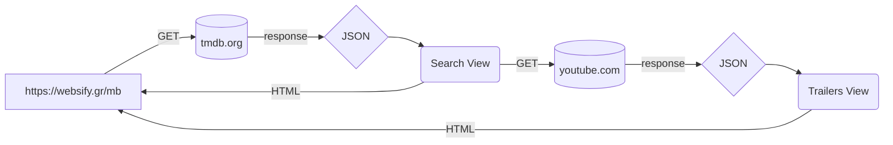

> # Working on TMDB API combining YouTube Player API using vanilla JavaScript, jQuery, Bootstrap and HTML
 >> ### `test it on` [Websify GR](https://websify.gr/mb/)
 
> ## TMDB API
>> ### `consuming data from `  [tmdb.org](https://www.themoviedb.org/) using vanilla JavaScript, jQuery, Bootstrap and HTML

    #
    
 > ## YouTube Player API
>> ### `consuming data from `  [youtube.com](https://www.youtube.com/) using vanilla JavaScript, jQuery, Bootstrap and HTML

    #

> API based movie browser without the need of any framework, using span tags sceleton and jQuery .load to fetch HTML, CSS and JS files.

    #
>## `Code Flow Diagram`

MD file created using https://stackedit.io/
